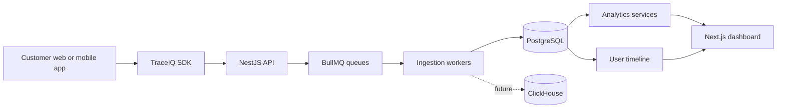
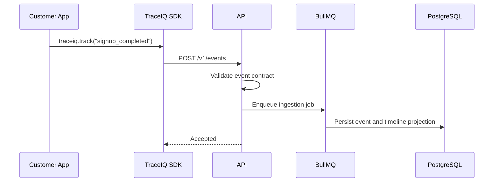
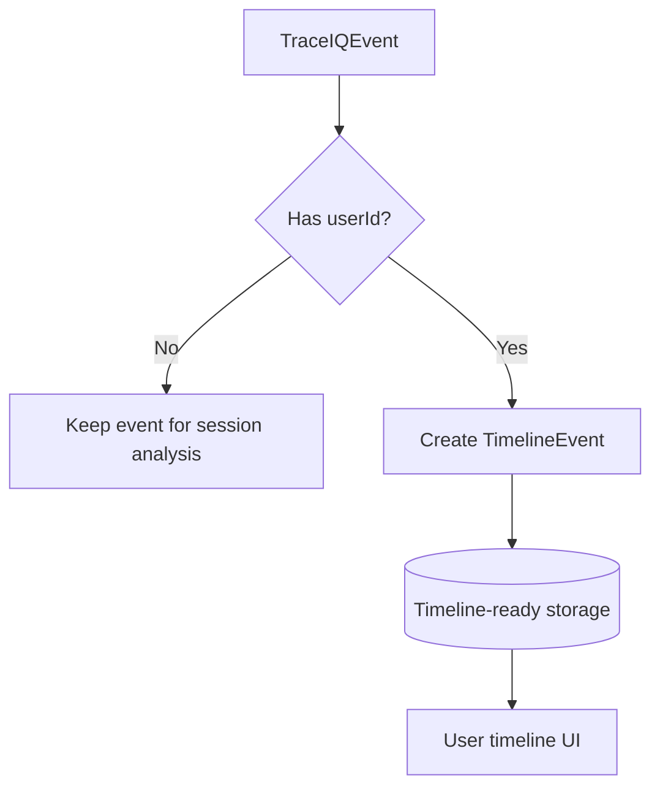

# Architecture Diagrams

## System Context

```mermaid
flowchart LR
  ProductApp[Customer web or mobile app] --> SDK[TraceIQ SDK]
  SDK --> API[NestJS API]
  API --> Queue[BullMQ queues]
  Queue --> Workers[Ingestion workers]
  Workers --> Postgres[(PostgreSQL)]
  Workers -. future .-> ClickHouse[(ClickHouse)]
  Postgres --> Analytics[Analytics services]
  Analytics --> Dashboard[Next.js dashboard]
  Postgres --> Timeline[User timeline]
  Timeline --> Dashboard
```

## Event Ingestion

```mermaid
sequenceDiagram
  participant App as Customer App
  participant SDK as TraceIQ SDK
  participant API as API
  participant Queue as BullMQ
  participant Store as PostgreSQL

  App->>SDK: traceiq.track("signup_completed")
  SDK->>API: POST /v1/events
  API->>API: Validate event contract
  API->>Queue: Enqueue ingestion job
  Queue->>Store: Persist event and timeline projection
  API-->>SDK: Accepted
```

## Timeline Projection

```mermaid
flowchart TD
  Event[TraceIQEvent] --> HasUser{Has userId?}
  HasUser -->|No| Anonymous[Keep event for session analysis]
  HasUser -->|Yes| Projection[Create TimelineEvent]
  Projection --> TimelineStore[(Timeline-ready storage)]
  TimelineStore --> DashboardView[User timeline UI]
```
